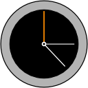

gbraad's Analogue Clock for VS Code
===================================

This is a quick-and-dirty port of my SciterJS/HTML5-based clock to VS Code.
Don't expect anything fancy... it is abstract and functional.

Authors
-------

|  |
|---|
| [@gbraad](https://gbraad.nl/social)  |
